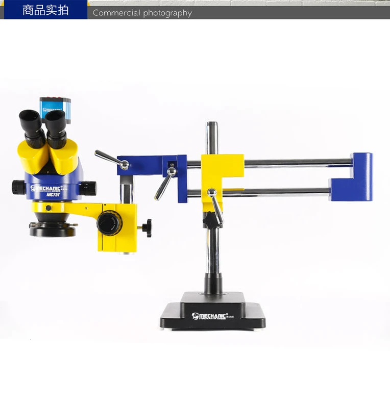
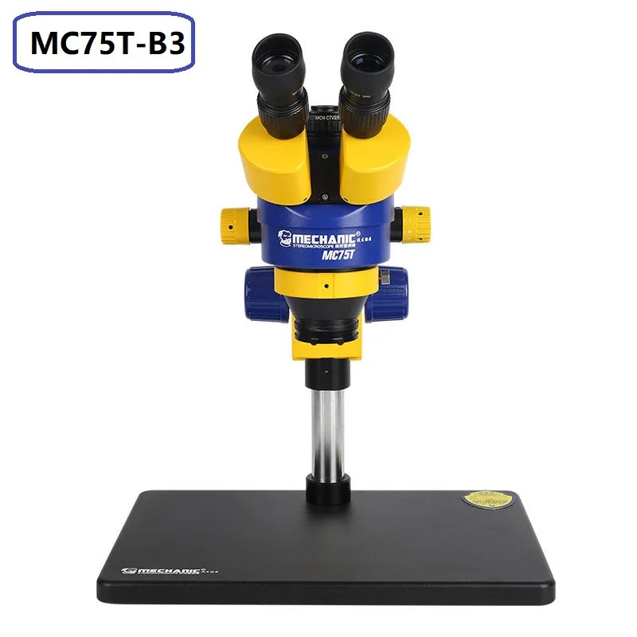
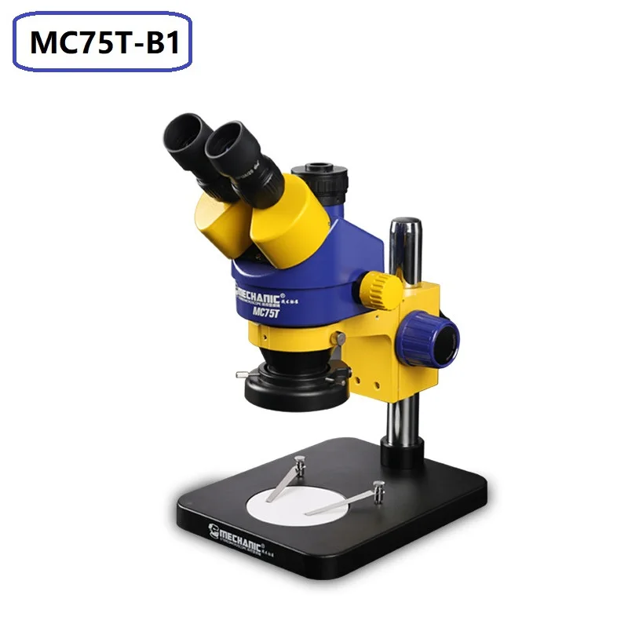
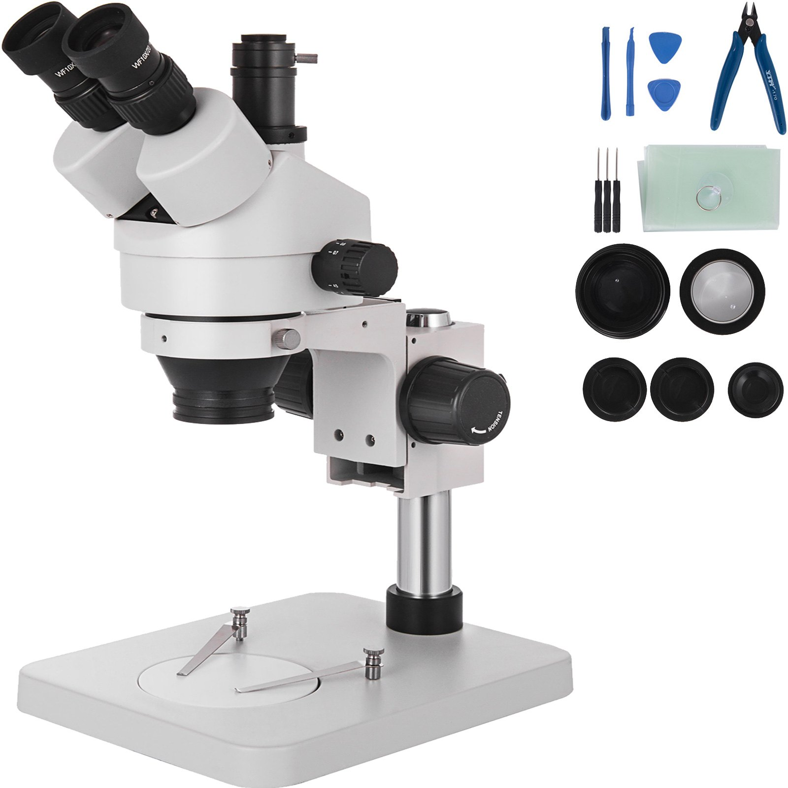
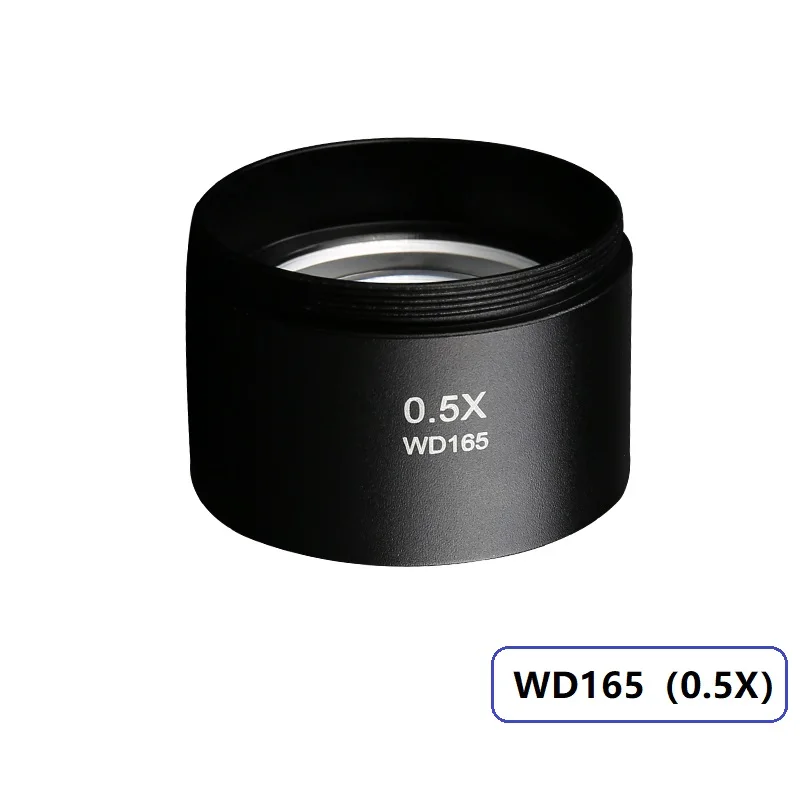
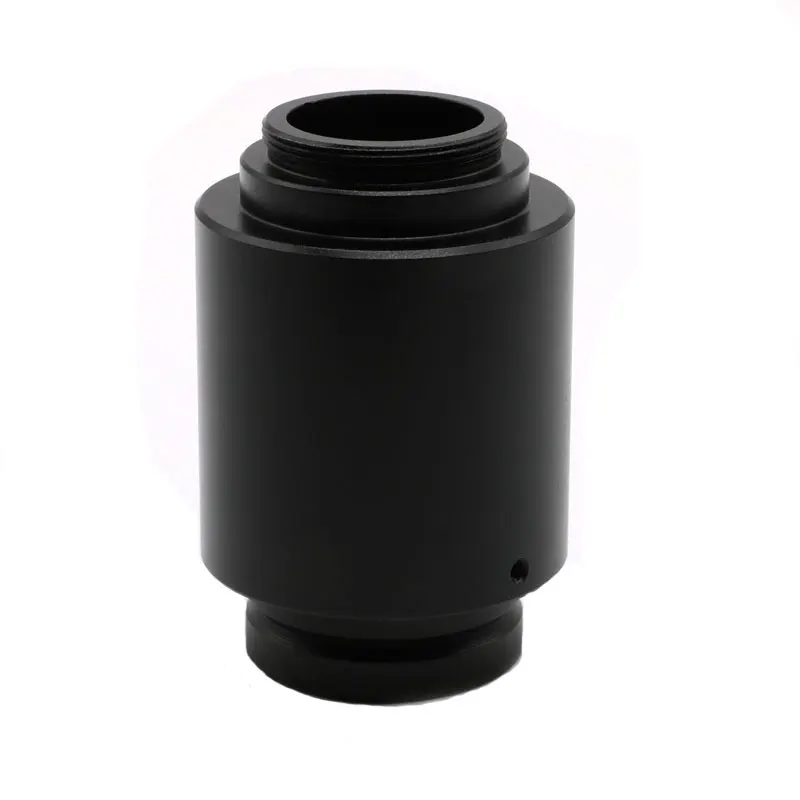

Mikroskop stereoskopowy to podstawa przy wykonywaniu prac precyzyjnych. Widzenie stereoskopowe oznacza, że obraz jest widoczny w 3D -
co za tym idzie, mamy percepcję odległości, i łatwo zobaczyć zjawiska takie, jak spuchnięte ścieżki, grubość lutów, nierówno postawione
komponenty. Widzenia stereoskopowego nie da się przedstawić na zdjęciu - trzeba samemu spojrzeć w mikroskop, żeby zrozumieć, jak bardzo
zmienia to komfort pracy.

Kupując mikroskop warto dopłacić do wersji trójokularowej, co pozwala na późniejsze dołączenie kamery, np. w celu streamowania lub robienia zdjęć.
Wersję dwuokularową polecam tylko do zastosowań absolutnie budżetowych.

Złotym standardem mikroskopów stereoskopowych jest "Minionek" MC75T. Kupując ten mikroskop w zestawie dostajemy oświetlacz oraz adapter optyczny 0.4x do kamery.

---

## Mechanic MC75T-L2

Wersja z ramieniem typo "boom", używa jej m.in. Spox\_2.

Zalety:

- Możliwość przesuwania mikroskopu na boki bez ruszania płytą - wygodne np. przy pracy na preheaterze.
- Brak kolumny - bardzo duże dostępne pole pracy.

Wady:

- Wysoka cena (ze względu na ciężar i przez to koszt wysyłki).
- Mniejsza stabilność, niż w innych wersjach - podatność na drgania.
- Zajmuje stosunkowo dużo miejsca na stole; latający boom może uderzyć np. w monitor.

Linki:

- [Aliexpress](https://www.aliexpress.com/item/4001232320100.html) (3500zł)
- [Katemedia](https://katemedia.pl/pl/strona-glowna/3134-mikroskop-stereo-triocular-mechanic-mc75t-stelaz-l2.html) (3600zł)

---

## Mechanic MC75T-B3

Wersja z dużą podstawą - nadaje się do średnich prac.

Zalety:

- Bardzo stabilna - brak wibracji.
- Niska cena.

Wady:

- Ograniczone pole robocze - nadaje się do średnich płytek (do 20x20cm).
- Niewygodna przy naprawach laptopów - kolumna nie pozwala ustawić płyty pod dowolnym kątem.

Linki:

- [Aliexpress](https://www.aliexpress.com/item/1005004582587520.html) (1500zł)

---

## Mechanic MC75T-B1

Wersja z małą podstawą - tylko do bardzo małych prac - np. jeśli ktoś naprawia wyłącznie telefony.

Zalety:

- Zajmuje mało miejsca - ma to znaczenie w małych serwisach.
- Bardzo stabilna - brak wibracji.

Wady:

- Bardzo małe pole robocze - nadaje się wyłącznie do małych płytek (do 10x10cm).

Linki:

- [Aliexpress](https://www.aliexpress.com/item/1005004582587520.html) (1500zł)
- [Katemedia](https://katemedia.pl/pl/strona-glowna/921-mikroskop-stereo-triocular-mechanic-mc75t-minionek.html) (2400zł)

---

## Klony i/lub firmy inne niż Mechanic

Dla osób chcących maksymalnie zaoszczędzić w grę wchodzi również zakup mikroskopu innej firmy. Kupując klon warto zwrócić uwagę na różnice, takie jak:

- Krótka kolumna
- Krótki wysięg ramienia typu boom
- Brak adaptera optycznego 0.4x w zestawie (zamiast tego adapter pasywny 1.0x)
- Brak oświetlacza w zestawie

Linki:

- [Eakins - klon MC75T-B3 z dodatkowym osprzętem](https://www.aliexpress.com/item/1005005807908388.html) (1450zł)
- [Vevor - klon MC75T-L2](https://www.vevor.pl/mikroskop-stereoskopowy-c_11070/trojokularowy-mikroskop-stereo-3-5x-90x-z-dwuramiennym-mikroskopem-wysiegnikowym-p_010928864370) (2200zł)
- [Vevor - klon MC75T-B1](https://www.vevor.pl/mikroskop-stereoskopowy-c_11070/3-5x-90x-trinokularowy-mikroskop-stereoskopowy-ze-statywem-kolumnowym-p_010559904386) (1200zł)

---

## Soczewka Barlowa 0.5x

Soczewka 0.5x jest *obowiązkowym* wyposażeniem mikroskopu stereoskopowego w serwisie. Zdecydowanie polecam
zamówić ją od razu z mikroskopem. Soczewka pełni dwie role:

1. Zwiększa pole widzenia - co niejednokrotnie pozwala np. zobaczyć cały układ BGA, a nie tylko jego część.
2. Zwiększa znacznie wysokość roboczą pomiędzy optyką mikroskopu, a lutowaną płytą, co pozwala bezpiecznie zmieścić tam kątową dyszę hotaira bez ryzyka przypalenia oświetlacza.

Nie polecam soczewki 0.7x - daje niewielkie powiększenie pola widzenia i praktycznie żadne powiększenie wysokości roboczej.
Soczewka 2.0x może być przydatna przy bardzo precyzyjnych pracach, ale przy tak dużych powiększeniach trzeba pamiętać,
że wibracje stają się już dość dużym problemem, zwłaszcza przy montażu mikroskopu na ramieniu (np. L2).

Linki:

- [Aliexpress (Mechanic)](https://www.aliexpress.com/item/1005004158960609.html) (100zł)
- [Aliexpress (RF4)](https://www.aliexpress.com/item/1005005215218835.html) (40zł)
- [Katemedia](https://katemedia.pl/pl/soczewki-obiektywy/930-obiektyw-mechanic-165mm-05x-do-mikroskopow-lens.html) (100zł)

---

## Adapter optyczny 0.4x

Adapter ten stanowy przejście z mikroskopu na C-mount, pokrywa sensor w przybliżeniu 1/2.7" - czyli taki, jak w kamerach mikroskopowych.
Adapter zawiera optykę oraz pierścień regulacji ostrości. W niektórych przypadkach konieczne jest dodatkowe odsunięcie adaptera od kamery o 1-3mm,
np. przy użyciu pierścienia dystansowego. Adapter zwykle jest dołączony w zestawie do mikroskopu - jeśli nie jest, jego późniejsze dokupienie może być problematyczne
ze względu na brak standardu mocowania mikroskop-adapter.

---

## Adapter optyczny 1.0x

Adapter ten stanowi przejście z mikroskopu na C-mount, pokrywa sensor w przybliżeniu Micro 4/3 (przekątna 21.6mm), np. w aparatach Lumix.
Nie nadaje się do typowych kamer "mikroskopowych". Adapter nie zawiera optyki - jest to po prostu tuba, zwykle z regulacją ostrości przez rozsuwanie tuby.

Linki:

- [Aliexpress](https://www.aliexpress.com/item/1005006053566494.html)
