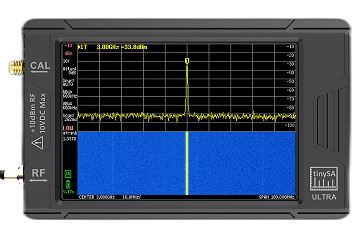
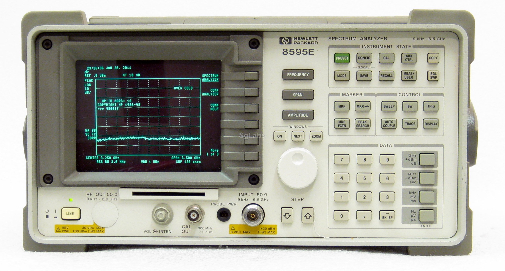
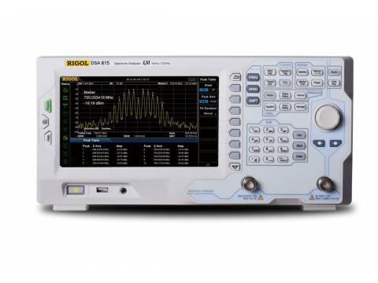
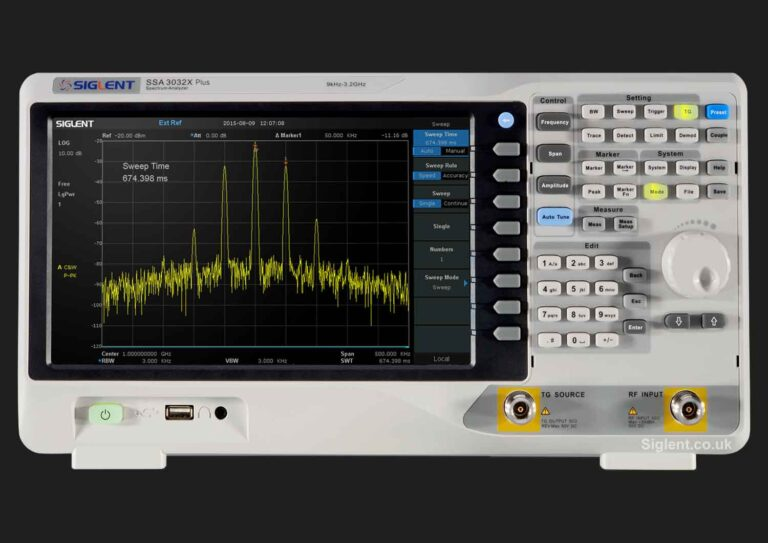

---

## tinySA Ultra

> *"Czy jest tanio? Jest tanio. Czy jest dobrze? Jest tanio."*

Jeśli nie stać Cię na maszynę z prawdziwego zdarzenia, pamiętaj, że lepszy rydz, niż nic.

### Linki

* [Strona producenta](https://www.tinysa.org/)
* [Eleshop](https://eleshop.eu/tinysa-ultra-spectrum-analyser.html) (~850zł)
* [Gotronik](https://www.gotronik.pl/tinysa-ultra-analizator-widma-od-100khz-do-5-3ghz-p-10214.html) (865zł)
* Uwaga na klony i podróbki!

---

## Używany analizator widma starej daty

Jeśli potrzebujesz mieć na biurku sprzęt z prawdziwego zdarzenia, a nie stać Cię na nowy analizator, pewnym wyjściem
jest zakup sprzętu z drugiej (lub siedemnastej) ręki. Za pieniądze rzędu 1000-4000zł da się okazyjnie dostać pełnowartościowy,
czasem wymagający drobnej naprawy analizator widma.

Wady tego rozwiązania są dwie:

1. Nie wiadomo, ile taki sprzęt pożyje, a naprawa bywa niepłacalna (np. wymiana/naprawa EYO w analizatorach HP to koszt rzędu $1000).
2. Kalibracja czasem pozostawia nieco do życzenia, a koszt kalibracji bywa również wysoki (analizator ze zdjęcia - koszt ok. €1500).

Zaletą jest oczywiście posiadanie pełnowymiarowego analizatora widma na biurku.

---

## Rigol DSA815-TG

### Linki

- [NDN](https://rigol.com.pl/pl/p/Analizator-Widma-Rigol-DSA815-TG-1.5GHz/2) (6900zł)

---

## Siglent SSA3015X Plus

### Linki

- [NDN](https://siglent.com.pl/pl/p/Siglent-SSA3015X-Plus-Analizator-Widma-Seria-SSA3000X-Plus-darmowa-licencja-TG-generator-sledzacy/170) (6629zł)

