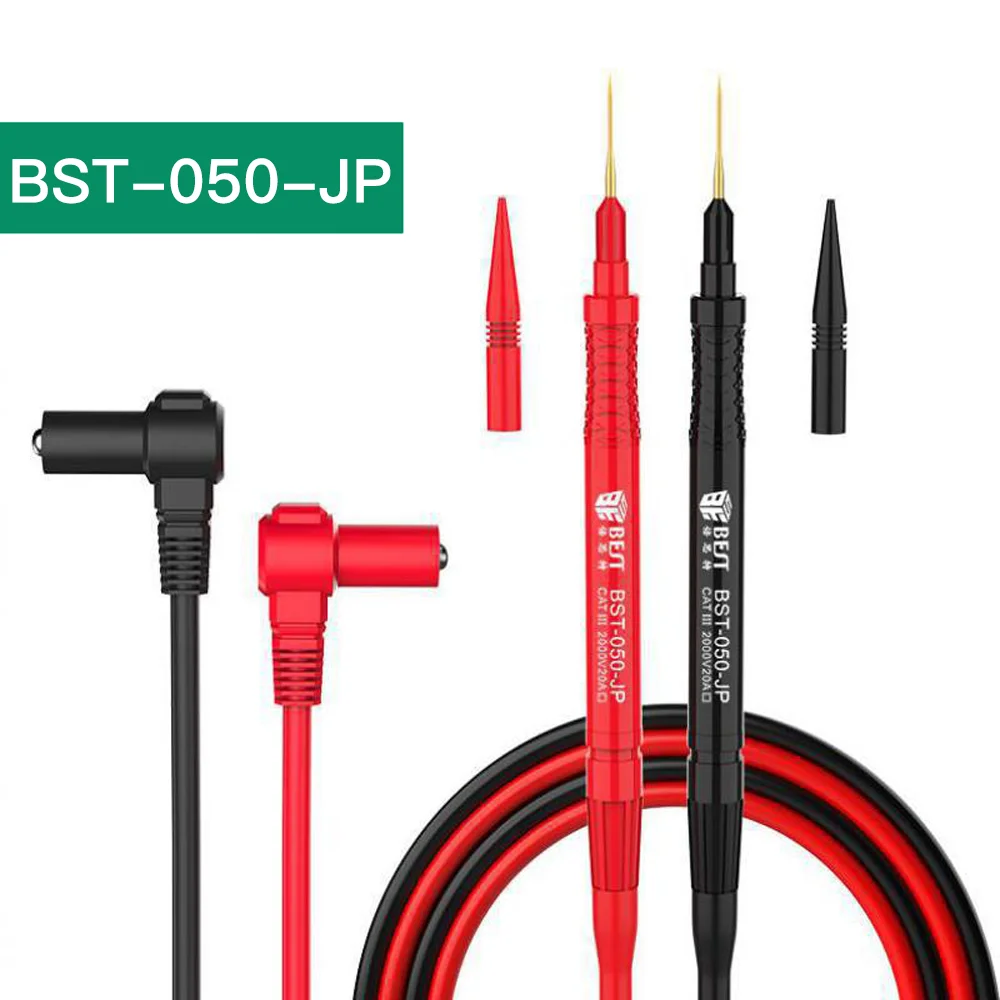

Jednym z najczęstszych błędów początkujących elektroników jest zakup zbyt drogiego multimetru, którego nie potrzebują - zamiast wydać te pieniądze
np. na lepszą lutownicę.

---

## Aneng AN9002

Multimetr absolutnie wystarczający w typowym warsztacie. Kupiłem go z myślą o użyciu jako data logger (ma łączność Bluetooth), ale został jako "główny" miernik na stole,
bo absolutnie niczego mu do tej roli nie brakuje.

Zalety:

- Wszystkie potrzebne zakresy - w tym pojemność i temperatura.
- Tryb "Auto" - woltomierz, omomierz i tester ciągłości w jednym. Dramatycznie przyspiesza typowe prace diagnostyczne.

Wady:

- Kąty widzenia na wyświetlaczu mogłyby być lepsze.
- Zestaw przewodów i końcówek dołączony do wersji "pro" jest średniej jakości - ledwo warty swojej ceny.

Linki:

- [Aliexpress](https://www.aliexpress.com/item/1005005056667273.html) (100zł)
- [Allegro](https://allegro.pl/oferta/multimetr-cyfrowy-bluetooth-aneng-an9002pro-automa-12560906046) (150zł)

---

## Brymen BM786

https://www.welectron.com/Brymen-BM786-Multimeter-EEVBlog-Edition

---

## Przewody pomiarowe Best BST-050-JP

Najlepsze znane mi sondy do mikropomiarów - idealne w serwisie lub na biurku projektanta. Przeznaczone typowo do bardzo małej elektroniki. Sondy są szalenie ostre,
nie zjeżdżają z padów, są w stanie przebić się przez izolację przewodów. Da się nimi bez problemu wbić np. w nogę układu QFN w rastrze 0.4mm.

Zalety:

- Fantastyczna precyzja.
- Wymienne końcówki.
- Silikonowe przewody.

Wady:

- Sondy nie są niezniszczalne - mogą się złamać np. przy upadku. Nie nadają się do trzymania np. w walizce z innym sprzętem.
- Wystarczy odrobina nieuwagi, żeby dziabnąć się w palec do krwi - są naprawdę tak ostre.

Linki:

- [Aliexpress - przewody i sondy](https://www.aliexpress.com/item/1005005373692067.html) (50zł)
- [Aliexpress - wymienne końcówki](https://www.aliexpress.com/item/1005005373692067.html) (15zł)
- [Serwisowe - przewody i sondy](https://allegro.pl/oferta/przewody-do-miernika-multimetru-kable-pomiarowe-sondy-banan-20a-bst-050-jp-13318175666) (90zł)
- [Serwisowe - wymienne końcówki](https://allegro.pl/oferta/koncowki-pomiarowe-szpilki-do-miernika-bst-050-jp-14209469632) (30zł)
